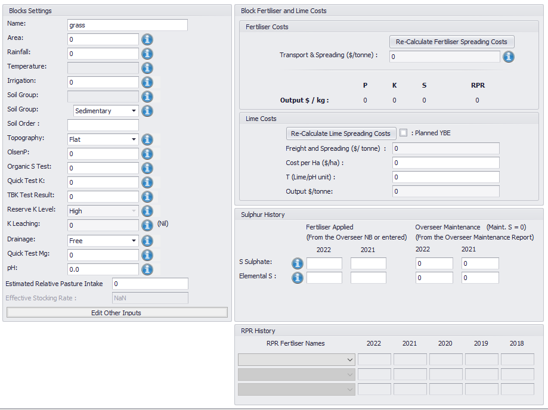
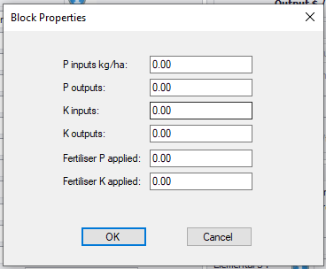
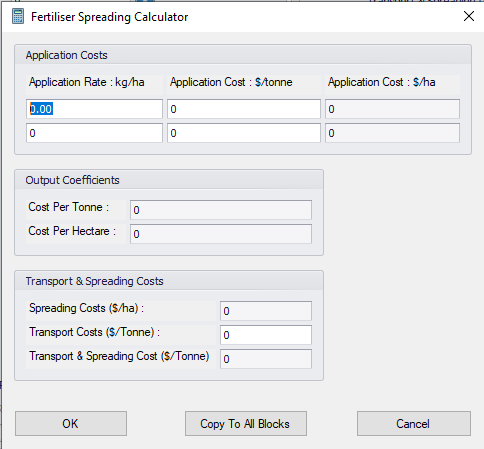
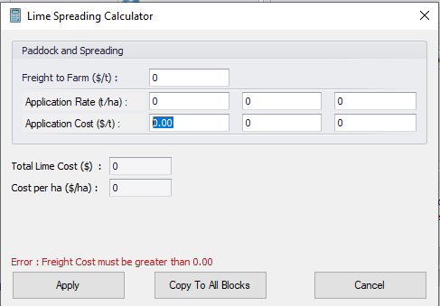

<h2>UI Suggestions</h2>
    <ul class="sub-menu">
        <li class="menu-item"><a href="UIstart">Basic Settings</a></li>
        <li class="menu-item"><a href="Blocks">Block Details</a></li>
        <li class="menu-item"><a href="Fertiliser">Fertiliser Details</a></li>
       <li class="menu-item"><a href="Enterprise">Enterprise Data</a></li>
       <li class="menu-item"><a href="Reports">Reports</a></li>
    </ul>

        <h3>Block Details</h3>
        
For each block the following information is required:

        
Soil test data, rainfall/drainage data, pasture intake (kg/DM/ha), fert spreading costs (including lime) sulphur history and RPR history.

        
The options for soil group, soil order, topography, drainage, and reserve K level can be found here: <a href="https://github.com/FANZ-Econometric/Econometric-documentation/blob/main/schema/Model_Request_details.md">Model Request Details</a>

        
For soil - either use soil group or order, you don't need both.

        
Options for entering other inputs or outputs such as supplements, fertiliser applied or effluent can be included however you want to capture it.

        
Sulphur soil tests can be entered in one of three ways (in order of use):

        <ul class="bullet">
          <li>Organic S</li>
          <li>Total S</li>
          <li>QTSO4</li>
          </ul>
          
If none are provided = 0 then a default of 10 is used.

        
        
    
Fertiliser and Lime spreading costs are calculated for each block.

    
    
    

