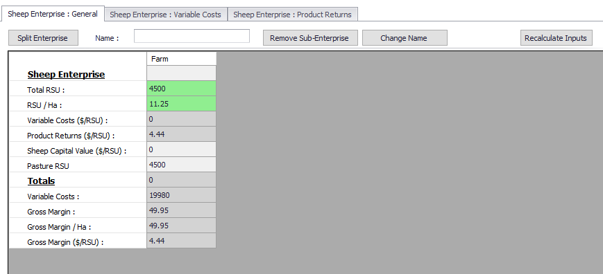
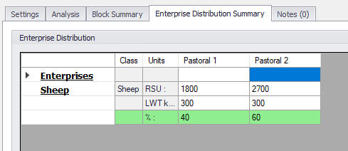
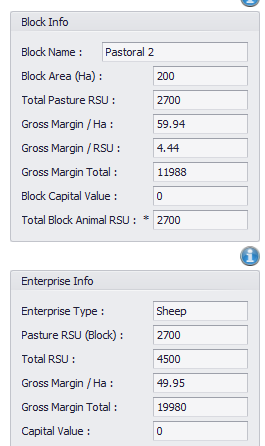

<h2>UI Suggestions</h2>
    <ul class="sub-menu">
        <li class="menu-item"><a href="UIstart">Basic Settings</a></li>
        <li class="menu-item"><a href="Blocks">Block Details</a></li>
        <li class="menu-item"><a href="Fertiliser">Fertiliser Details</a></li>
       <li class="menu-item"><a href="Enterprise">Enterprise Data</a></li>
       <li class="menu-item"><a href="Reports">Reports</a></li>
    </ul>

  

Enterprises supported by the model are:

    <ul class="bullet">
        <li>Dairy</li>
        <li>Sheep</li>
        <li>Beef</li>
        <li>Deer</li>
        <li>Dairy replacements (currently defaulted to use beef product)</li>
    </ul>
    
The details that are captured for an enterprise need to be allocated to each block. You may do this as direct entry or you may provide some setting s in the UI that does this for you. How you gather the information and do calculations to transform the data in the model requirements is up to how you want to use it.

    
You may have a reconciliation tool that you already use for working out Gross margins, pasture consumption and live weight sold or dead.

    
    
    

   
