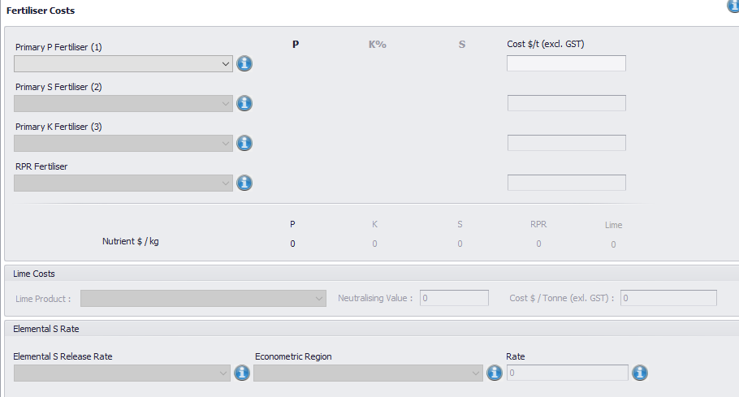
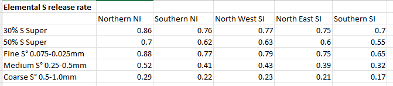

<h2>UI Guide</h2>
    <ul class="sub-menu">
        <li class="menu-item"><a href="UIstart">Basic Settings</a></li>
        <li class="menu-item"><a href="Blocks">Block Details</a></li>
        <li class="menu-item"><a href="Fertiliser">Fertiliser Details</a></li>
       <li class="menu-item"><a href="Enterprise">Enterprise Data</a></li>
       <li class="menu-item"><a href="Reports">Reports</a></li>
    </ul>

   

    <h3>Fertiliser Details</h3>
    
The engine requires the cost of fertiliser by kg of nutrient. You may choose to connect this to your own source of products and prices or just provide a entry fields.

    
If using lime or sulphur, then some additional fields are required.

    
    
Lime requires the neutralising value and also an acidification rate (this is the equivalent of the Inorganic Soil Pool H from Overseer block report).

    
Sulphur requires an Elemental S release rate. Default values based on region and particle size are provided here.

    

