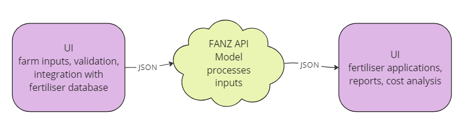

  
The ‘FertResearch Econometric Model’ (Econometric model) is designed as a tool to be used by the technical representatives of Fertiliser Association of New Zealand’s member companies, to prepare reports for and facilitate discussions with their shareholder customers. The tool estimates: the value of maintenance fertiliser nutrient applications; the potential within a farm system to increase fertility and production and the potential saving from reducing fertiliser inputs in some situations. In addition, the model can be used to evaluate the impact that changes to nutrient prices could have on typical farm systems.

The Econometric model is used to show the impact of different fertiliser nutrient application rates, it does not make recommendations on the selection of fertiliser products. The model is specific to only pasture-based systems, and covers Phosphorous by default. Optional considerations include Potassium, Sulphur, RPR and Lime. 

 

            
  

