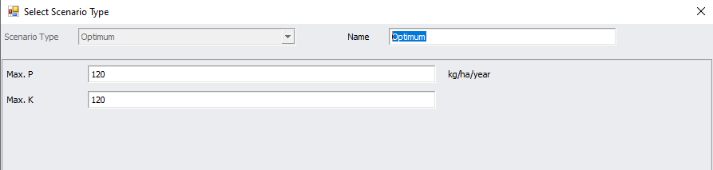

<h2>UI Suggestions</h2>
    <ul class="sub-menu">
        <li class="menu-item"><a href="UIstart">Basic Settings</a></li>
        <li class="menu-item"><a href="Blocks">Block Details</a></li>
        <li class="menu-item"><a href="Fertiliser">Fertiliser Details</a></li>
       <li class="menu-item"><a href="Enterprise">Enterprise Data</a></li>
       <li class="menu-item"><a href="Reports">Reports</a></li>
    </ul>

      
    <h3>Reports</h3>
    
You will need a means to trigger a scenario and capture the extra inputs needed for the optimum and constrained scenarios.

Input fields for each block are also needed for the user defined and constant scenarios.

A range of reports are returned by the API along with the nutrient values. These could be displayed as graph or tables. You may also wish to provide a way to print reports.

    
    
    

